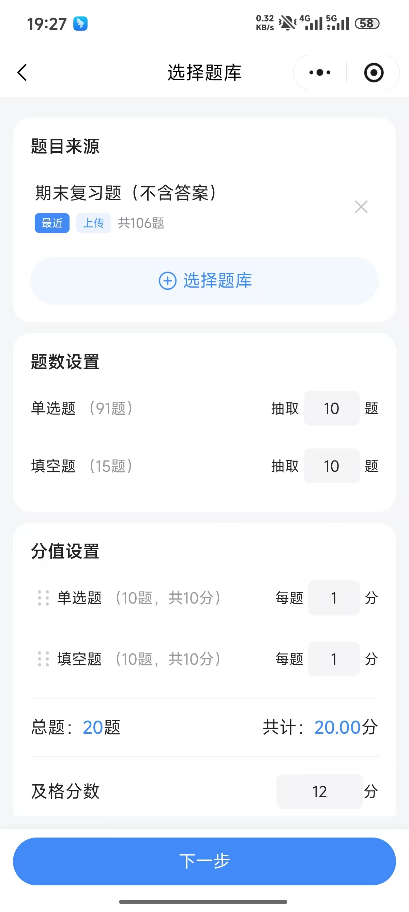
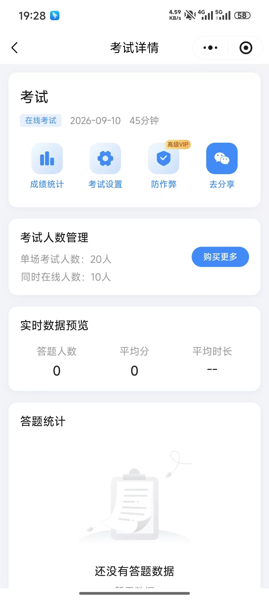
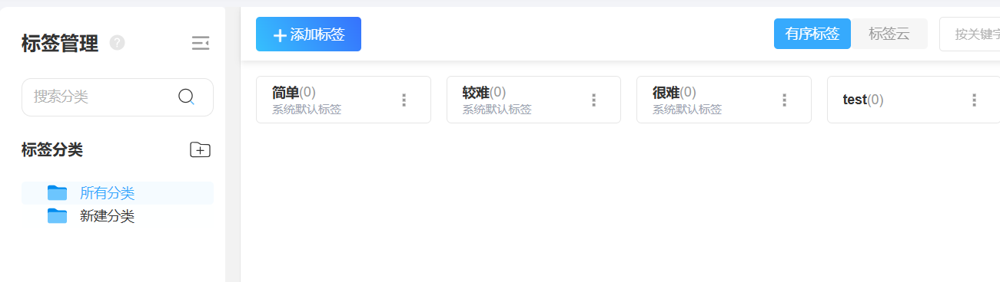
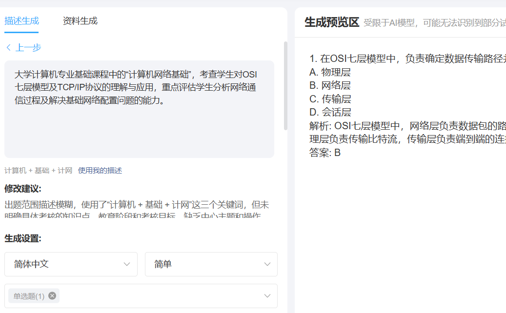
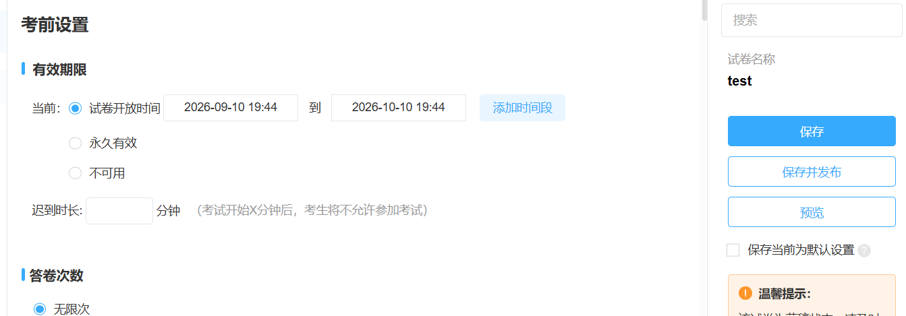
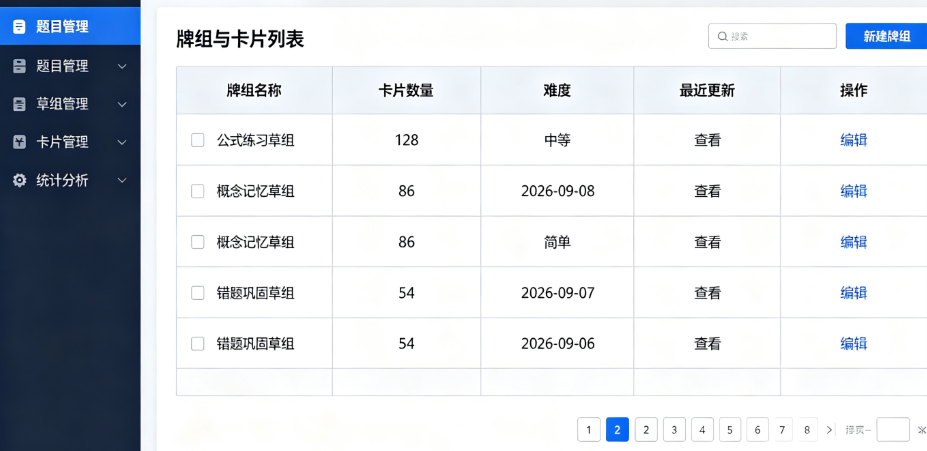
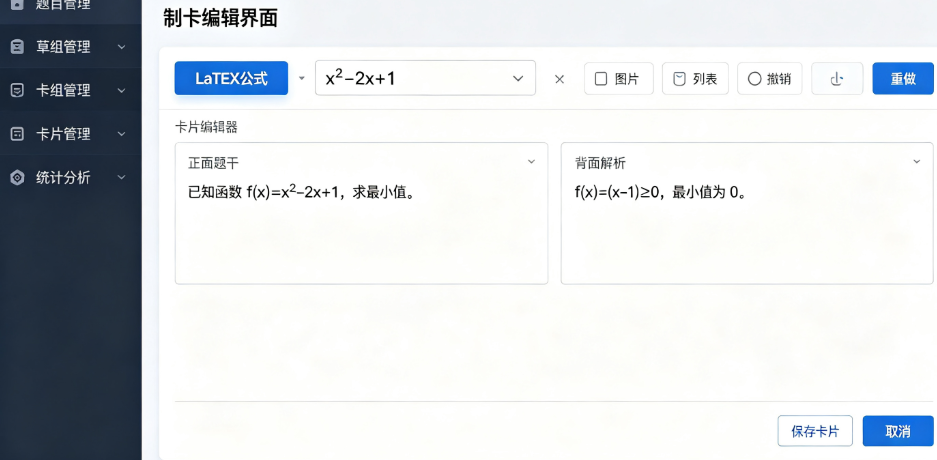
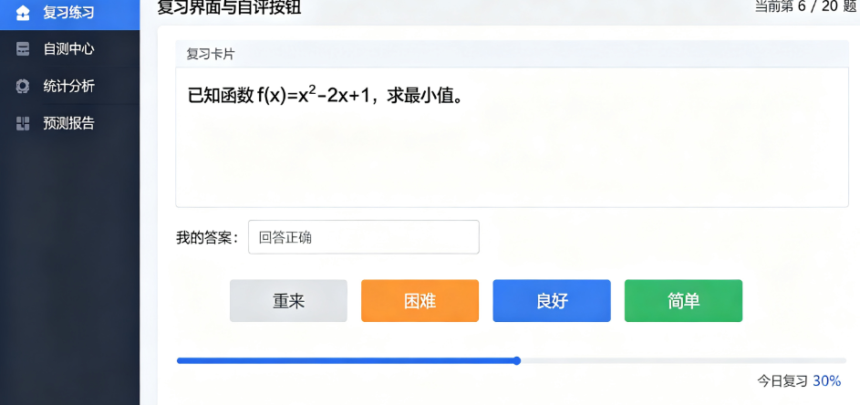
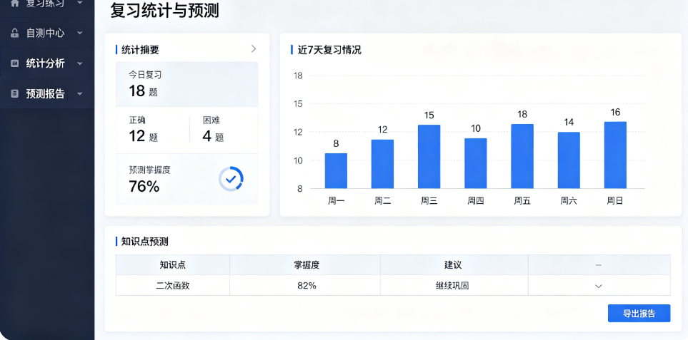

# 智能题库管理系统 竞品分析报告

> 文档版本：V1.0
> 编制团队：【韩昊骋】【耿桂彤】【郭智斌】（3 人小组）

<!--pagebreak-->

## 目录

<!--toc-->

<!--pagebreak-->

## 1 文档说明

### 1.1 编写目的

本文档是《复杂系统设计》课程第一阶段（选题与竞品分析）的交付物，也是后续系统分析、设计、实现与验收阶段的输入。文档以“智能题库管理系统”（以下简称“本项目”）为出发点，调研同类产品以回答三个问题：同类产品已具备哪些功能、分别解决什么问题；本项目应包含哪些功能、可借鉴哪些设计；本项目应在哪些方面改进以形成立足点。

### 1.2 适用范围与读者对象

表1-1 文档适用范围

| 项目 | 说明 |
| --- | --- |
| 适用产品 | 智能题库管理系统（qbank），版本口径 v1.3.0 |
| 适用阶段 | 课程第 1—2 周（选题与竞品分析阶段） |
| 主要读者 | 课程评审教师、项目小组成员、后续接手研发的成员 |
| 使用方式 | 作为系统分析与系统设计的输入，不作为对外商业宣传材料 |

<!--pagebreak-->

## 2 竞品分析概述

### 2.1 分析背景

《复杂系统设计》课程要求 3 人小组完成一个复杂系统的研发，第一阶段为“选题 + 竞品分析”，并明确要求：必须为选题找到至少 3 款同类产品，比较其特点、优势与劣势，且要实际运行竞品，理解其功能与业务逻辑。

### 2.2 分析目标

本阶段要达成三个目标：一是摸清同类产品的主流功能集与业务逻辑，形成本项目可对照的功能基线；二是识别竞品的优势与不足，作为功能取舍与改进的依据；三是明确本项目的差异化定位，为系统分析阶段的用例图、时序图等建模提供确定边界。

### 2.3 分析范围与边界

分析范围限定为“题库管理 + 练习/考试 + 学情分析”功能域，不涉及课程直播、教务排课、证书发放等外围业务；分析维度限定为产品功能、适用群体、部署与商业模式、优势与劣势，不做市场规模与财务测算。

### 2.4 分析方法与信息来源

本报告采用“桌面研究 + 实机体验”两段式方法：桌面研究收集竞品官网、操作手册、价格页与公开评测资料，整理其功能集与定价模式；实机体验按课程要求注册并实际运行各竞品，走通“建题库—导题—练习/考试—看统计”完整链路，记录操作截图与体验结论，结果见附录 A。

### 2.5 竞品名单

按“同功能域、形态互补、可比可学”的原则，选定 2 款商业竞品与 1 款开源参照产品，如表2-1 所示。

表2-1 竞品选取名单

| 编号 | 产品名称 | 厂商/来源 | 产品形态 | 选取理由 |
| --- | --- | --- | --- | --- |
| P1 | 考试宝（企业版） | 上海聚学网络 | SaaS 云服务 | 国内在线考试与题库 SaaS 代表，题库容量与导题能力突出 |
| P2 | 优考试 | 广州匡优 | SaaS + 私有化买断 | 同时提供云端与局域网私有化部署，与本项目部署形态最接近 |
| P3 | Anki | 开源社区 | 开源本地工具 | 开源同类参照，用于对照开源模式下的能力边界 |

<!--pagebreak-->

## 3 本项目产品概述

### 3.1 产品定位

本项目是集“管题—练题—分析”于一体的智能题库软件：教师可建题库、批量导题、共享协作；学生可刷题、错题重练；并借助 AI 大模型获得题目质量分析与学情报告。产品支持私有化部署、开源免费，可打包为 Windows / macOS / Linux 桌面应用。一句话概括差异化：私有化部署 + 数据自主可控 + 开源免费 + AI 不绑定厂商。

### 3.3 本项目功能集（截至 v1.3.0，均为已实现功能）

表3-2 本项目功能集

| 模块 | 功能要点 |
| --- | --- |
| 题目与分类 | 5 种题型（单选/多选/填空/判断/简答）；难度（1—5）、知识点标签、二级分类、题库归属；关键词检索与分页；增删改与批量删除 |
| 批量导入与 AI | Excel(.xlsx)/CSV 三步向导导入（错误行标红跳过，兼容 UTF-8/GBK）；导入预览时 AI 补全缺失答案与解析 |
| 练习闭环 | 顺序/随机/错题重做三种模式；按分类/题库/题型/难度筛选；交卷自动判分；错题本累计与重练；一键收藏 |
| 共享协作 | 题目/题库共享给指定用户或公开；只读/可编辑两级权限；订阅（实时跟随）与拷贝（记录来源） |
| 统计与 AI 分析 | 统计看板（题型/难度分布、近 14 天正确率趋势、易错分类 Top5）；单题质量分析；个人学情报告（前端直连大模型） |
| 题库管理 | 题目分组到题库，题库增删改查与题目计数；删除题库时题目保留仅解除归属 |
| 多端与主题 | B/S 网页 + Electron 桌面端（Windows/macOS/Linux）+ 服务端渲染轻量版；管理员维护多套主题，用户可自选 |

<!--pagebreak-->

## 4 竞品全景对比

### 4.1 竞品概况总表

按课程要求的对比口径，从“产品名称—功能集—适用群体（客户）—不足”四个维度汇总，如表4-1 所示。

表4-1 竞品概况总表

| 产品名称 | 功能集 | 适用群体（客户） | 不足 |
| --- | --- | --- | --- |
| 考试宝（企业版 P1） | 批量/模板/单题导题，16 类题型与音视频解析，组织考试、自动阅卷、成绩统计，题库购买 | 企业、学校、培训机构，以及个人职业资格备考用户 | SaaS 订阅交付，数据存于厂商云端，自主可控性弱；免费版容量受限；不支持私有化与二次开发 |
| 优考试（P2） | AI/Excel/Word 导入，12 类题型，多维标签，AI 出题与组卷，14 种监考，成绩与学情分析 | 政企单位、院校、教培机构 | 重心在严肃考试与培训运营，练习侧偏轻；私有化版万元级买断；闭源不可定制 |
| 本项目（已研发） | 题目全生命周期管理、批量导入、题库与分类、三种练习模式、自动判分、错题本、统计看板、AI 质量分析与学情报告 | 教师与培训讲师、学生与备考人群、教育机构与院校管理员 | 题型仅 5 类；缺少组卷、监考、防作弊、排名等严肃考试能力；无移动端 |

说明：本表是竞品分析的总论性结论。两款商业竞品分别代表“SaaS 云服务”与“私有化买断”两种形态，开源参照 Anki 代表“本地优先工具”形态；它们的共同短板正是本项目的切入点——成本可控与数据自主。

### 4.2 功能维度对比矩阵

表4-2 功能维度对比矩阵（●支持 ○部分支持或需附加条件 —不支持）

| 能力维度 | 考试宝 P1 | 优考试 P2 | 本项目 |
| --- | --- | --- | --- |
| 题型数量 | ● 16 类 | ● 12 类 | ○ 5 类 |
| 题目批量导入 | ● Word/PDF/TXT/Excel | ● Excel/Word/AI | ● Excel/CSV |
| AI 辅助导题或补全 | ● AI 导题 | ● AI 导入 | ● 预览时 AI 补全 |
| 分类/知识点/难度体系 | ● 章节+难度+标签 | ● 知识点+多维标签 | ● 二级分类+标签+难度 |
| 题库分组与共享协作 | ● 分组可见 | ● 分组 | ● 共享+两级权限+订阅/拷贝 |
| 练习模式 | ● 顺序/随机/题型 | ● 刷题练习 | ● 顺序/随机/错题重做 |
| 判分/错题本/收藏 | ● 自动判分、错题本，收藏 | ● 自动判分、错题本，收藏部分支持 | ● 判分/错题本/收藏 |
| 数据统计看板 | ● 考情分析 | ● 成绩统计 | ● 看板+趋势+易错 Top5 |
| AI 分析（出题/质量/学情） | ● AI 出题/解析 | ● AI 出题、考情分析 | ● 单题质量分析+个人学情报告 |
| 严肃考试（组卷/监考/防作弊/排名） | ● 防作弊 | ● 14 种监考手段 | — |
| 私有化/开源/数据自主 | — 数据在厂商云 | ● 局域网买断，本地部署 | ● MIT 开源自助部署，数据自主 |
| 终端形态（桌面/移动） | ○ 网页/APP/小程序 | ○ 浏览器/小程序 | ● Web+Electron 桌面端 |
| 界面主题定制 | ○ | ○ | ● 多套主题 |

说明：本表逐维度对照三款产品的能力覆盖，可得三条结论：其一，本项目在“练习闭环 + 统计 + AI 分析”主线上与竞品基本持平；其二，在“私有化、开源、数据自主、主题定制”上形成独占优势；其三，在“题型数量、严肃考试、移动端”上明显落后，需明确是否补齐或主动放弃。

### 4.3 部署方式与商业模式对比

表4-3 部署方式与商业模式对比

| 对比项 | 考试宝 P1 | 优考试 P2 | 本项目 |
| --- | --- | --- | --- |
| 交付形态 | SaaS 订阅 | SaaS 订阅 + 私有化买断 | 开源自建 |
| 免费额度 | 有免费版，容量受限 | 免费版 45 人同考、3000 考次/月 | 完全免费 |
| 付费参考 | 399—1199 元/月（分档） | 标准会员 398 元/月、3280 元/年（2026-09-10 起）；局域网正式版买断 1 万元起 | 0 元（自备服务器与 AI 调用成本） |
| 数据存放 | 厂商云 | 云或用户内网 | 用户自有服务器/内网 |
| 二次开发 | 不支持 | 不支持 | 源码开放（MIT） |
| 绑定风险 | 订阅到期即停用 | 买断版无订阅压力 | 无厂商依赖 |

说明：本表说明成本结构与风险归属。竞品普遍采用订阅或买断方式，费用与容量绑定；本项目采用 MIT 开源，无授权费用与订阅风险，代价是需自行部署与运维。

<!--pagebreak-->

## 5 重点竞品逐一分析

### 5.1 考试宝（企业版）

#### 5.1.1 产品概况

考试宝是国内主流的在线考试与题库 SaaS 平台，分个人版与企业版：个人版面向职业资格备考用户（官方称覆盖 10000+ 类目、36 亿+ 题目）；企业版面向单位、学校与培训机构，提供题库上传、组织考试、学员与子管理员管理、学习资料与题库购买等能力。管理员用电脑网站，学员可用 APP、微信小程序或电脑网站作答。

#### 5.1.2 优势

1. 导题与题型能力强：支持 Word/PDF/TXT 批量导入与模板导入，并提供 AI 导题，可从复杂文档甚至图片中提取题目；覆盖 16 类题型（含连线、完型填空、选词填空、案例分析等），满足成人考试与资格考试场景；
2. 终端与配套服务齐全：学员侧 APP + 小程序 + 网站三端，传播与使用便利；并提供题库购买与人工导题服务，帮助零资源用户快速起步。

#### 5.1.3 劣势

1. 数据与成本受制于厂商：SaaS 交付使题库与答题数据存放于厂商云端，学校或机构无法完全掌控；免费版限制明显（学员 50 人以内、单个题库 1000 题、题库 5 个、每月 3 次考试），付费档位 399—1199 元/月，随规模递增；
2. 不可私有化、不可二次开发，练习侧偏弱：未提供开源或自助私有化部署方案，无法按需定制；产品重心在“组织考试”，学生日常练习与错题复盘的闭环不如专业刷题工具细致。

#### 5.1.4 业务流程梳理

考试宝企业版的业务信息流为一条主链：管理员创建题库 → 批量/模板/单题导入试题 → 从题库编卷并发布考试 → 学员通过 APP/小程序/网站作答 → 系统自动阅卷评分并排名 → 管理员查看成绩统计，形成“发布—作答—数据回流”的封闭回路。

### 5.2 优考试

#### 5.2.1 产品概况

优考试定位为“集学习培训、AI 刷题、严肃性考试于一体的在线考试系统”，同时提供云端 SaaS 与局域网私有化部署两种交付方式，官网称一次购买永久使用，并兼容国产操作系统与数据库（如银河麒麟、统信 UOS）。

#### 5.2.2 优势

1. 私有化与防作弊成熟：支持局域网离线运行、数据本地留存、适配国产软硬件；具备人脸识别、三路音视频、霸屏、防切屏等 14 种监考手段，可支撑高利害考试；
2. AI 全链路且交付灵活：AI 覆盖导题、出题、阅卷到考情分析，具备万人级大规模承载能力；云端订阅与买断并行，短期活动还可按次付费。

#### 5.2.3 劣势

1. 成本门槛高且闭源不可定制：局域网正式版买断 1 万元起，标准会员 398 元/月、3280 元/年（2026-09-10 起调价），对个人教师与微型团队偏高；不开放源码，功能与数据结构由厂商决定，二次开发受限；
2. 功能过重：产品体系偏向企业培训与严肃考试，纯练习场景的轻量化体验不足，课程、证书、缴费等运营模块对只想要“建题库 + 刷题”的用户属于冗余。

#### 5.2.4 业务流程梳理

优考试的业务信息流为：搭建知识与题库（导入或 AI 生成）→ 组卷（手动/随机/混合）→ 发布考试或课程练习 → 学员作答 → 客观题自动判分、主观题 AI 或人工批阅 → 生成成绩报表与学情报告 → 教师复盘教学；相比考试宝多出“课程学习”与“证书发放”两段，构成“学—练—考—评”闭环。

### 5.3 开源同类参照：Anki

Anki 是开源（AGPL）的间隔重复记忆卡片程序，2006 年发布，采用 SM-2/FSRS 调度算法；卡片支持 HTML、图片、音频、LaTeX 公式与填空（Cloze）等形态，可经 AnkiWeb 在电脑与移动端同步，亦可自建同步服务器。其主要特点与局限如下：

表5-3 Anki 特点与局限

| 维度 | 特点 | 局限 |
| --- | --- | --- |
| 学习机制 | 间隔重复算法成熟，可最大化长期记忆效率 | 依赖用户自评掌握程度，无自动判题 |
| 内容组织 | 笔记字段 + 卡片模板，可高度自定义；牌组支持层级 | 制卡步骤复杂，无结构化“题库/分类/难度”概念 |
| 数据归属 | 本地 SQLite 存储，可导出 .apkg，数据属于用户 | 自建同步服务器面向高级用户，无官方支持 |
| 生态 | 1000+ 社区插件、海量共享牌组 | 无内置 AI 出题；插件质量参差 |
| 场景适配 | 适合语言与长期记忆类学习 | 不适合组织化出题、组卷、考试与班级统计 |

说明：本表用于对照“开源模式下的能力边界”。Anki 说明两点：开源 + 本地优先在个人学习工具领域已被验证可行；纯开源项目通常缺少面向教学组织的能力（共享协作、班级统计、批量导入），这正是本项目在开源形态下需补齐并形成差异之处。

<!--pagebreak-->

## 6 功能借鉴与改进

### 6.1 借鉴：本项目已包含的竞品功能

对照表4-2，本项目对竞品成熟能力的吸收情况如表6-1 所示。

表6-1 竞品功能借鉴映射表

| 来源竞品 | 借鉴的功能 | 本项目实现情况 |
| --- | --- | --- |
| 考试宝 / 优考试 | 题库批量导入与 AI 辅助导题 | 已实现 Excel/CSV 三步向导导入（错误行标红跳过），并在导入预览时调用 AI 补全缺失答案与解析 |
| 优考试 | AI 出题与个人学情报告 | 已实现单题质量分析与个人学情报告（前端直连大模型） |
| 优考试 | 题库分组与按范围共享 | 已实现题库分组、指定用户/公开共享、只读/可编辑两级权限 |
| 考试宝 / 优考试 | 基于作答数据的统计与学情反馈 | 已实现正确率趋势、题型/难度分布、易错分类 Top5 |
| 考试宝 / 优考试 | 练习模式多样 | 已实现顺序/随机/错题重做三种模式 |
| 考试宝 / 优考试 | 客观题自动判分 | 已实现 5 类题型确定性判分引擎 |
| 全部竞品 | 错题沉淀与复盘 | 已实现错题本与错误次数累计、标记掌握、错题重练 |

说明：本表说明本项目并非从零设计，而是在吸收竞品成熟功能的基础上构建，符合课程“先理解竞品、再形成自己产品”的要求。

### 6.2 取舍：本项目刻意不做或不优先做的事

1. 严肃考试全流程（组卷、监考、防作弊、排名）与移动端 App：前者属高投入、强合规能力，且与“日常练习”场景重叠度低；后者已有 Electron 桌面端 + 响应式网页覆盖主要场景，原生 App 投入产出比低——两者本阶段均不做；
2. 课程/证书/缴费等运营模块与内置海量题库：前者偏离“管题—练题—分析”主线，主动放弃；后者属长期内容积累而非技术问题，不正面竞争。

### 6.3 改进：本项目相对竞品的差异点

表6-2 本项目改进与差异化点

| 序号 | 改进点 | 相对竞品的差异 | 对应功能 |
| --- | --- | --- | --- |
| 1 | 开源免费、源码开放且可用于教学 | 竞品均为闭源商业软件；本项目 MIT 开源，可自由使用、修改、二次开发与商用，源码可直接用于教学实践 | 全项目 / 工程结构 |
| 2 | 自助私有化部署、数据完全自主 | 优考试需万元级买断；本项目自备服务器即可部署，无授权费用，数据存于用户自有 MySQL，不经第三方云端 | 部署能力 / 数据层 |
| 3 | AI 不绑定厂商 | 竞品 AI 能力固定使用自家模型与服务；本项目前端直连任意 OpenAI 兼容接口，可自选服务商甚至本地 Ollama，密钥仅存本机浏览器 | AI 分析 |
| 4 | 共享协作的权限与订阅机制 | 在竞品“分组可见/云盘共享”基础上，增加只读/可编辑两级权限、订阅实时跟随与拷贝溯源 | 共享协作 |
| 5 | 界面主题定制与桌面端一体化 | 竞品界面固定；本项目支持管理员维护多套主题并设全局默认，并提供 Electron 桌面端，可在无公网环境下直连内网服务 | 界面主题 / 桌面端 |

说明：本表是本阶段最关键的产出，直接回答“改进了哪些功能”。第 1—4 项构成本项目区别于所有竞品的核心特征，也是后续系统分析与设计阶段的重点建模对象。

<!--pagebreak-->

## 7 结论与后续计划

### 7.1 结论

1. 选题存在明确的同类产品：竞品在题库管理、批量导入、自动判分、错题本、统计反馈等基础能力上高度成熟，构成必须达到的功能基线；其共同短板集中在成本门槛高、数据自主性弱、闭源不可定制；
2. 本项目以“开源免费 + 私有化部署 + 数据自主 + AI 不绑定厂商”切入，具备清晰的立足点；当前主要差距是题型数量（5 类 vs 竞品 12—20 类）、严肃考试能力与移动端缺失，需在后续阶段明确优先级。

### 7.2 现存差距与风险

表7-1 现存差距与应对

| 序号 | 差距/风险 | 影响 | 应对方向 |
| --- | --- | --- | --- |
| 1 | 题型仅 5 类，少于竞品 | 复杂题型场景受限 | 后续版本评估增加连线、完型等题型的成本与收益 |
| 2 | 缺少严肃考试能力 | 无法承接正式考试场景 | 明确放弃或规划为可选模块，避免无限扩张 |
| 3 | 无移动端 | 碎片化刷题体验弱于竞品 | 先做响应式优化，App 列为远期规划 |
| 4 | 自行部署有运维门槛 | 非技术用户上手成本较高 | 提供一键脚本与部署文档，降低门槛 |
| 5 | 实测覆盖有限（优考试私有化版受权限限制） | 部分结论仍依赖公开资料 | 争取可获取的试用环境，据实测结果修订结论 |

说明：本表如实列出当前不足，供下一阶段排定优先级时参考。

### 7.3 后续实证与研发计划

表7-2 后续计划

| 序号 | 事项 | 输出物 |
| --- | --- | --- |
| 1 | 整理并归档竞品实机体验记录与操作截图 | 竞品实机体验记录表（附录 A）+ 截图归档 |
| 2 | 基于实测结果修订表4-2 功能矩阵与第 6 章改进点 | 本报告 V1.1 |
| 3 | 将功能集转化为用例模型（外部视角）与对象/时序模型（内部视角） | 系统分析阶段文档与 UML 图 |
| 4 | 论证 AIGC 工具（大模型）在竞品调研、文档整理与代码生成中的辅助作用 | 过程中的提示词与产出记录 |

说明：本表延续课程“实际运行竞品、理解其功能与业务逻辑”的要求，把实测记录的归档整理与成果修订列为下一步事项。

<!--pagebreak-->

## 附录A 竞品实机体验记录表

本附录按统一口径记录三款竞品的实机体验结果，每款一份，记录项与课程要求一致。

表A-1 考试宝（P1）实机体验记录表

| 记录项 | 内容 |
| --- | --- |
| 竞品名称与版本 | 考试宝（企业版），管理端线上版本（2026-09）；学员端 微信小程序 |
| 体验时间与方式 | 2026-09-10，手机小程序 |
| 体验环境 | 手机微信小程序 |
| 走通链路 | 注册登录 → 创建工作台 → 题库中心新建“期末复习题”题库 → 用官方 Word 模板导入该题库（选择/填空，约 2 分钟） → 考试中心智能组卷 20 题 → 学员扫码作答 → 自动阅卷与排名 → 后台查看成绩统计 |
| 关键操作截图 |      |
| 功能观察 | 具备：三种导题方式（批量/模板/单题）、16 类题型、AI 导题、智能组卷、自动阅卷、按分组开放题库、子管理员权限、小程序与公众号关联。缺失：开源与自助私有化部署入口。与预期不同：免费版容量限制在注册时即生效，调整题库可见范围须回到题库中心单独设置 |
| 业务逻辑观察 | 信息流为“管理员建库 → 发布考试 → 学员作答 → 数据回流统计”的封闭回路；题库、试卷、考试三者独立成对象，靠“分组可见范围”关联；学员侧只读作答，不具备建题能力 |
| 优势感受 | 导题最顺畅，Word 模板的容错提示清晰；小程序扫码即练，传播成本低；成绩统计自动出排名，几乎零配置 |
| 不足与吐槽 | 数据全部在厂商云端，无整库导出入口；免费版限 5 个题库/1000 题/每月 3 次考试，稍具规模即需付费；练习侧仅有“刷题”入口，错题复盘不如专业刷题工具细致 |
| 对本项目的启示 | 模板与错误提示是建库第一门槛，本项目 Excel/CSV 导入应补齐逐行错误定位；“题库按分组可见”可对照本项目共享权限设计；其容量绑定价模式正是本项目以开源免费切入的机会点 |

表A-2 优考试（P2）实机体验记录表

| 记录项 | 内容 |
| --- | --- |
| 竞品名称与版本 | 优考试在线考试系统 |
| 体验时间与方式 | 2026-09-10，注册 SaaS 免费版实测；官网页面 |
| 体验环境 | Windows 10 |
| 走通链路 | 注册开通 → 建知识点与题库 → Excel 导入 20 题 → AI 出题生成 10 题并人工校对 → 组卷发布考试（开启人脸识别与防切屏） |
| 关键操作截图 |    |
| 功能观察 | 具备：Excel/Word/AI 三类导入、12 类题型、多维标签筛选、固定/随机/混合组卷、14 种监考手段、AI 阅卷与考情分析、课程与证书模块。缺失：开源；纯练习形态的轻量模式。与预期不同：AI 出题结果须逐题人工校对，不能直接入库 |
| 业务逻辑观察 | 信息流为“建知识点 → 组卷或发布课程 → 学员作答 → AI 或人工批阅 → 成绩报表与学情报告 → 教师复盘教学”，比考试宝多出课程学习与证书发放两段，构成“学—练—考—评”闭环 |
| 优势感受 | 监考项可逐条勾选，配置颗粒度细；AI 出题一次生成成组题目并附解析，明显节省建库时间；买断一次永久使用的承诺比订阅制更让人安心 |
| 不足与吐槽 | 免费版限 45 人同考、3000 考次/月，超出即需升级；课程、证书、缴费等模块对只要“建题库+刷题”的用户冗余；标准会员 398 元/月、局域网正式版买断 1 万元起，个人教师成本偏高；闭源不可定制 |
| 对本项目的启示 | 证明“AI + 私有化”已被市场接受，本项目定位具备现实基础；AI 生成结果须保留人工确认，本项目“预览时 AI 补全、人工可改”更稳妥；其功能过重反证本项目应聚焦“管题—练题—分析”主线 |

表A-3 Anki（P3）实机体验记录表

| 记录项 | 内容 |
| --- | --- |
| 竞品名称与版本 | Anki 桌面版（2026-09 版本，AGPL 开源） |
| 体验时间与方式 | 2026-09-10，本机安装桌面版实测；制作“计算机网络”牌组 60 张卡片 |
| 体验环境 | Windows 10 本机安装；离线运行，复习无需联网；未使用移动端 |
| 走通链路 | 安装 → 新建牌组 → 手工制卡（正面题干、背面解析，含 1 张 LaTeX 公式卡与 1 张图片卡） → 导入社区共享牌组（.apkg） → 每日复习并按“重来/困难/良好/简单”自评 → 查看复习统计与预测 |
| 关键操作截图 |     |
| 功能观察 | 具备：间隔重复调度（SM-2/FSRS）、HTML/图片/音频/LaTeX/填空卡、牌组层级、.apkg 导入导出、1000+ 社区插件、可自建同步服务器。缺失：结构化题库与分类/难度体系、批量成卷、自动判题、班级统计。与预期不同：卡片质量完全取决于制卡者，无题干校验 |
| 业务逻辑观察 | 以“卡片—牌组—调度”为核心：制卡 → 打标签归牌组 → 按算法排出当日待复习卡 → 自评掌握度 → 算法调整下次间隔，形成“记忆—反馈—再排程”的个人闭环，回路仅服务个体，缺少师生之间的信息流 |
| 优势感受 | 长期记忆效率确有优势，复习计划由算法自动安排；数据存于本地 SQLite 并可整体导出，数据完全属于用户；开源协议允许自行修改与二次开发 |
| 不足与吐槽 | 制卡繁琐，无批量结构化导入与成卷能力；完全依赖学习者自评，对错由人判定；共享牌组质量参差，插件依赖社区维护；不适合组织化出题与班级学情统计 |
| 对本项目的启示 | 验证了“开源 + 本地优先”在个人学习领域可行；其数据可整体导出、离线可用的体验与本项目“数据自主可控”定位一致；但纯开源工具缺少共享协作、批量导入与班级统计，正是本项目在开源形态下需要补齐并形成差异的部分 |

说明：三份记录表按同一 10 项口径填写，P1、P2 为实际运行所得，P3 为开源对照样本；上表“关键操作截图”行内嵌入的 12 张实机截图，原始文件归档于 `docs/竞品实机体验截图/`。
